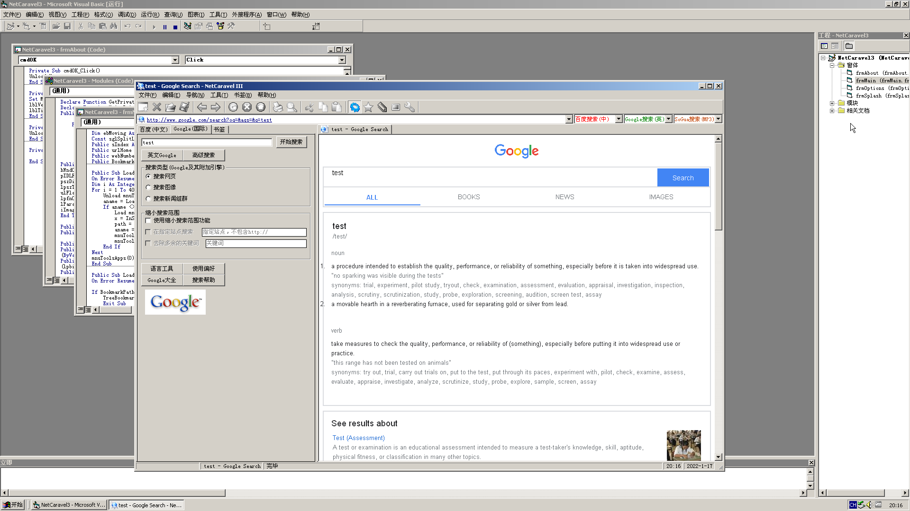

# NetCaravel 3.0 网际快帆 3.0

这是我高中时的一个作品，从旧硬盘里翻出来了，算是我第一个相对成形的产品，放到 github 上以示留念。

在 2000 年左右的互联网，这种 NetXXXX 的命名很流行，我自然也无法免俗。

论代码复杂度，在这个版本之前的版本会相对更加复杂，记得当时是仓促参加什么比赛，所以重写了这样的一个版本。

代码并不多，也很仓促，肯定也有不少 bug，但不管怎样，就这样了~

## 截图

 

## 如何运行

依赖 VB6 的运行库，在这个最后版本的压缩包 https://github.com/vimac/NetCaravelLegacy/releases/tag/v20030402 这里已经提供

还有控件依赖也一并在压缩包里面提供了。

## 如何修改

1. 先安装好一个可用的 Visual Basic 6.0
2. 随便创建一个工程，注册附在代码里面的 ocx 控件
3. 打开工程文件
4. 运行或者编译

## 授权协议

[MIT 协议](./LICENSE)
